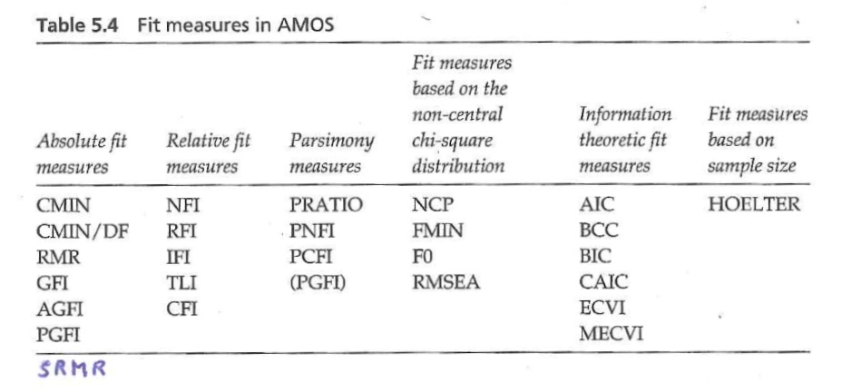

Exercises about Rex Kline's book (for Tue., Oct. 08)
===============================================================================

> Read pages 124-127 (until "… do so by default"), pages 130-137 (from "Unique estimates" to "...is discussed later"), and pages 146-153 (from "A healthy perspective" to end) of Rex Kline's book. Don't worry if you don't understand everything in the section on "rules for nonrecursive structural models" (pages 132-137). I simply want to you to know where to look when you run into problems one day. Please also read the excerpt from Niels Blunch's (2008) book I distributed in class last Thursday (pp. 110-118).

**1. There are two necessary but insufficient conditions for identification. Name these conditions and be prepared to explain each of them in some detail.**

1. **Counting Rule:** The model degrees of freedom must be at least zero.
2. Every latent variable (including the residual terms) must be assigned a scale.

If we violate the counting rule, then the software won't be able to uniquely estimate the parameters for the under-determined model. 

**2. In some graphic representations of path analysis models, there is a numeral "one" next to the path that leads from the disturbances to their associated endogenous variables. What does the "1" mean?**

We have to assign latent variables a scale, including the disturbances. Under a *unit-loading identification* constraint, the path coefficient between a disturbance and the corresponding endogeneous variable is set to 1, putting the disturbances on a related scale.

**3. It is possible to verify whether a given model is identified before running the model in lavaan? Explain your answer.**

Yes, we can check for some sufficient conditions. For example, recursive models are identified, and non-recursive models that meet the rank condition are identified.

**4. Among the following four types of models, which ones are always identified: recursive, nonrecursive, bow-free pattern, bow pattern?** 

Recursive

**5. Kline talks about the order condition and the rank condition. Are these conditions necessary, sufficient, or both?**

The order condition is necessary, the rank one sufficient. The order condition says that the number of excluded variables for each endogenous variable => the number of endogenous variables - 1

**6. What is empirical underidentification?** 

Extreme collinearity (r >= 0.90) effectively reduces the number of observations since two variables are probably measuring the same thing. In this case, the model may be effectively underidentified. A model may be also be empirically underidentified if a path has a very high or low estimate. Other causes involve non-normality, non-linearity and specification errors.

**7. Kline gives suggests two strategies for researchers who want to analyze complex structural models for which no clear identification heuristics exists. Name the two strategies.**

1. Check if the model computes with hypothetical data.
2. Start with a simpler subset model that passes identification heuristics. See if that computes, then build it up from there.

**8. Consider the model in Figure 5.5 (page 111). How many different pieces of information are there in the sample covariance matrix? How many parameters are being estimated? Explain how you got to these numbers.**

P = 21

Q = 14 = 7 path coefficents + 1 unanalyzed relationships + 2 variances of exogenous variables + 4 variances of disturbances

df = 7

**9. Consider the model in Figure 6.3 (page 136). How many different pieces of information are there in the sample covariance matrix? How many parameters are being estimated? Explain how you got to these numbers.**

P = 10

Q = 5 path coefficents + 2 unanalyzed relationships + 2 variances of exogenous variables + 2 variances of disturbances

df = -1

**10. Be prepared to explain the difference between "absolute fit measures", "relative fit measures", and "fit measures based on the non-central Chi-square distribution", the way Blunch (2008) defines them.**

Fit indices describe the distance between the observed covariance and the estimated covariance. In other words, they are based on the residual matrix

* _Absolute fit measures_: Don't judge the fit against other models.
* _Relative fit measures_: Judge the fit against some basis model. Allows us to compare the several models against a common model.
* _Non-central Chi^2 measures_: Start with the assumption that models can only be approximately correct. Make the Chi-distribution non-central. Examines approximate fit, instead of perfect fit which is examined by a central Chi^2 distribution.

**11. According to Blunch, to which category belongs each of the following fit indices: Chi-square, RMSEA, CFI, and SRMR?**
CMIN, SRMR: Abs
RMSEA: Noncentral
CFI: Relative

